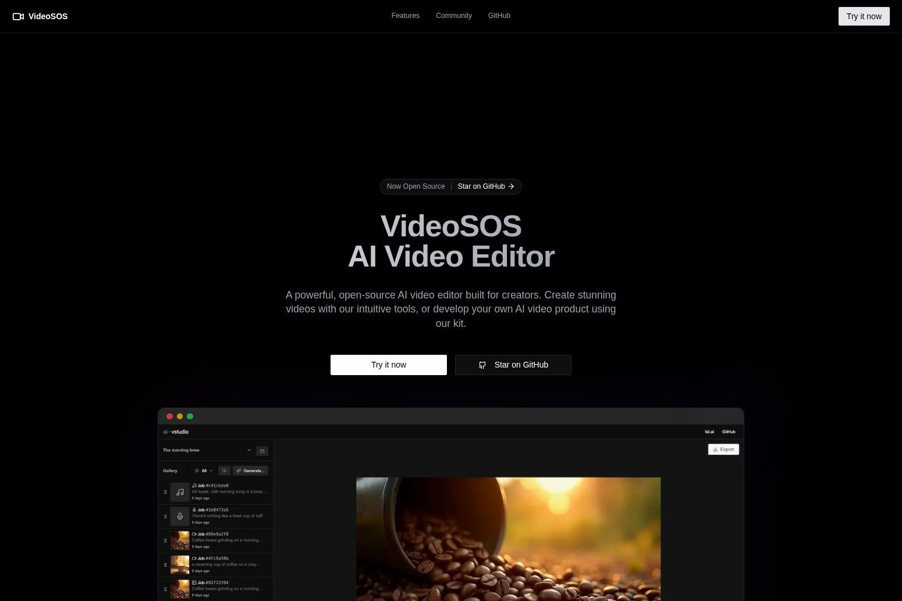

# VideoSOS

[](https://opensource.org/licenses/MIT)
[](https://nextjs.org)
[](https://remotion.dev)

A powerful, open-source AI video editor built for creators. This is an enhanced fork of the original AI Video Starter Kit by the fal.ai community, redesigned to run entirely in the browser.

## Screenshots

### Landing Page


### Video Editor


---

## 🇬🇧 English

### Key Improvements

✅ **Fully Autonomous Operation**: Server dependencies have been removed; everything runs in the browser.  
✅ **Local Video Processing**: FFmpeg.wasm for client-side processing.  
✅ **Expanded Set of AI Models**: Added models from different categories on fal.ai.  
✅ **Improved Export**: Support for audio and correct duration handling.  
✅ **UI Bug Fixes**: Video preview on the timeline and token display have been fixed.

### AI Providers

VideoSOS supports multiple AI providers simultaneously:

- **[fal.ai](https://fal.ai)** - Comprehensive AI model infrastructure with 50+ models for image, video, and audio generation
- **[Runware.ai](https://runware.ai)** - High-performance AI inference platform with 100+ models including FLUX, Google Imagen, Ideogram, Kling, and more

You can use either provider independently or both simultaneously. Simply add your API keys in the Settings dialog (click the gear icon in the app).

#### Getting API Keys

- **FAL API Key**: Get it from [fal.ai/dashboard/keys](https://fal.ai/dashboard/keys)
- **Runware API Key**: Sign up at [runware.ai](https://runware.ai) and get your key from the dashboard

Both API keys are stored locally in your browser and never sent to our servers.

### Tech Stack

- [fal.ai](https://fal.ai) - AI model infrastructure
- [Runware.ai](https://runware.ai) - High-performance AI inference platform
- [Next.js](https://nextjs.org) - React framework
- [Remotion](https://remotion.dev) - Video processing
- [IndexedDB](https://developer.mozilla.org/docs/Web/API/IndexedDB_API) - Browser-based storage
- [Vercel](https://vercel.com) - Deployment platform
- [UploadThing](https://uploadthing.com) - File upload

### Quick Start

1. Clone the repository:

```bash
git clone https://github.com/timoncool/videosos
cd videosos
```

2. Install dependencies:

```bash
npm install
```

3. Start the development server:

```bash
npm run dev
```

Open [http://localhost:3000](http://localhost:3000) to see the application.

### Contributing

Contributions are welcome! See the original project's [Contributing Guide](CONTRIBUTING.md) for more information on how to get started.

### Credits

Assembled by [Nerual Dreming](https://t.me/nerual_dreming) - founder of [ArtGeneration.me](https://artgeneration.me/), tech blogger, and neuro-evangelist.

This project is a fork of the original [AI Video Starter Kit](https://github.com/fal-ai-community/video-starter-kit) from the fal.ai community.

### License

This project is licensed under the MIT License - see the [LICENSE](LICENSE) file for details.

---

## 🇷🇺 Русский

## Скриншоты

### Главная страница


### Видеоредактор


### Ключевые улучшения

✅ **Полностью автономная работа**: Удалены серверные зависимости, все работает в браузере.  
✅ **Локальная обработка видео**: FFmpeg.wasm для обработки на стороне клиента.  
✅ **Расширенный набор AI моделей**: Добавлены модели из разных категорий fal.ai.  
✅ **Улучшенный экспорт**: Поддержка аудио и корректная обработка длительности.  
✅ **Исправленные UI баги**: Превью видео на таймлайне и отображение токена.

### Технологический стек

- [fal.ai](https://fal.ai) - Инфраструктура для AI-моделей
- [Next.js](https://nextjs.org) - React-фреймворк
- [Remotion](https://remotion.dev) - Обработка видео
- [IndexedDB](https://developer.mozilla.org/docs/Web/API/IndexedDB_API) - Хранилище в браузере
- [Vercel](https://vercel.com) - Платформа для развертывания
- [UploadThing](https://uploadthing.com) - Загрузка файлов

### Быстрый старт

1. Клонируйте репозиторий:

```bash
git clone https://github.com/timoncool/videosos
cd videosos
```

2. Установите зависимости:

```bash
npm install
```

3. Запустите сервер для разработки:

```bash
npm run dev
```

Откройте [http://localhost:3000](http://localhost:3000), чтобы увидеть приложение.

### Участие в проекте

Мы приветствуем ваш вклад! Для получения дополнительной информации см. [Руководство по участию в проекте](CONTRIBUTING.md) оригинального репозитория.

### Авторы

Собрал [Nerual Dreming](https://t.me/nerual_dreming) - основатель [ArtGeneration.me](https://artgeneration.me/), техноблогер и нейро-евангелист.

Этот проект является форком оригинального [AI Video Starter Kit](https://github.com/fal-ai-community/video-starter-kit) от сообщества fal.ai.

### Лицензия

Этот проект лицензирован по лицензии MIT - подробности см. в файле [LICENSE](LICENSE).

---

## 📝 Changelog / История изменений

### October 2025

#### [PR #32](https://github.com/timoncool/video-starter-kit/pull/32) - Fix voiceover model parameter mapping
**🇬🇧 EN:** Added `inputMap` entries for 5 voiceover models that use non-standard parameter names (minimax/speech-02-hd, playht/tts/v3, dia-tts/voice-clone, chatterbox/text-to-speech, f5-tts).  
**🇷🇺 RU:** Добавлены записи `inputMap` для 5 моделей озвучки, использующих нестандартные названия параметров.

#### [PR #31](https://github.com/timoncool/video-starter-kit/pull/31) - Fix model endpoints and parameters
**🇬🇧 EN:** Corrected endpoints for 5 models (Ideogram V3, Veo 3 Fast, Kling 1.5 Pro) and added `seconds_total: 30` parameter for Stable Audio. Fixed UI to show duration controls for all music models.  
**🇷🇺 RU:** Исправлены эндпоинты для 5 моделей (Ideogram V3, Veo 3 Fast, Kling 1.5 Pro) и добавлен параметр `seconds_total: 30` для Stable Audio. Исправлен UI для отображения контроля длительности для всех музыкальных моделей.

#### [PR #30](https://github.com/timoncool/video-starter-kit/pull/30) - Add AI models with costs and popularity ranking
**🇬🇧 EN:** Added 48 new AI models across categories (Images, Video, Music, Voiceover) with cost information and popularity-based sorting in UI. Full localization support (EN/RU).  
**🇷🇺 RU:** Добавлено 48 новых AI моделей в категориях (Изображения, Видео, Музыка, Озвучка) с информацией о ценах и сортировкой по популярности в UI. Полная локализация (EN/RU).

#### [PR #29](https://github.com/timoncool/video-starter-kit/pull/29) - Fix FAL link and footer
**🇬🇧 EN:** Made FAL.ai link clickable and removed project footer text from the editor interface.  
**🇷🇺 RU:** Сделана кликабельной ссылка на FAL.ai и удален текст футера проекта из интерфейса редактора.

#### [PR #28](https://github.com/timoncool/video-starter-kit/pull/28) - UI improvements
**🇬🇧 EN:** Updated landing page screenshot, made logo clickable, removed share button, and added privacy notice to export dialog.  
**🇷🇺 RU:** Обновлен скриншот главной страницы, логотип сделан кликабельным, удалена кнопка "поделиться", добавлено уведомление о конфиденциальности в диалог экспорта.

#### [PR #26](https://github.com/timoncool/video-starter-kit/pull/26) - Fix build and root page
**🇬🇧 EN:** Restored root page functionality and removed flag emojis from language switcher.  
**🇷🇺 RU:** Восстановлена функциональность корневой страницы и удалены флаги-эмодзи из переключателя языков.

#### [PR #25](https://github.com/timoncool/video-starter-kit/pull/25) - Fix i18n context and routing
**🇬🇧 EN:** Resolved internationalization context and routing issues - added locale prop, enabled browser language detection, fixed logo navigation.  
**🇷🇺 RU:** Исправлены проблемы с интернационализацией и маршрутизацией - добавлен параметр локали, включена автоопределение языка браузера, исправлена навигация логотипа.

#### [PR #24](https://github.com/timoncool/video-starter-kit/pull/24) - Fix i18n bugs
**🇬🇧 EN:** Fixed multiple i18n issues including root redirect, button navigation, and layout structure using next-intl Link component.  
**🇷🇺 RU:** Исправлены множественные проблемы i18n, включая редирект с корня, навигацию кнопок и структуру layout с использованием компонента next-intl Link.
