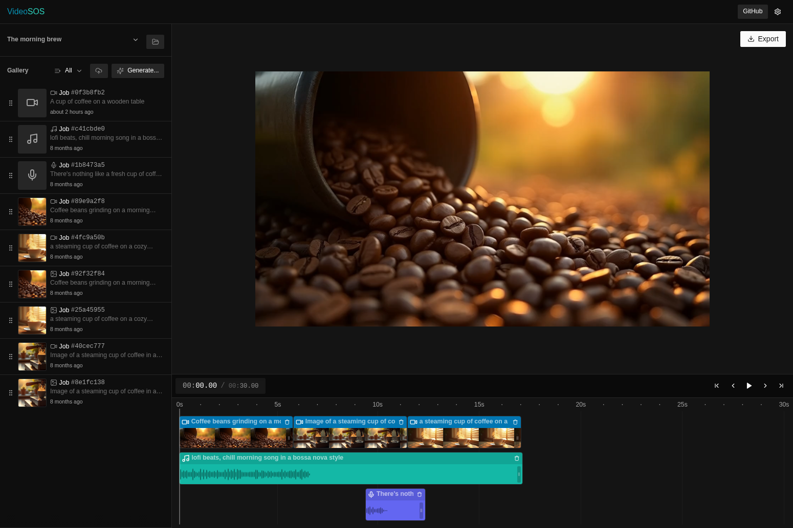
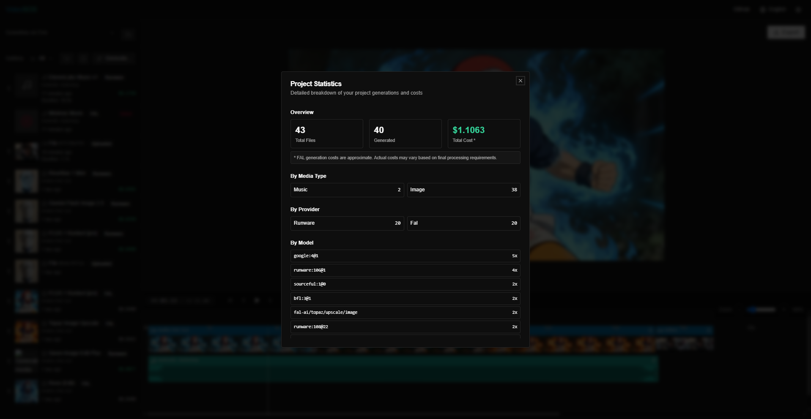

<div align="center">

# VideoSOS

**Open-source AI video editor with 100+ models — text-to-video, image-to-video, lip sync, music, voiceover.**

[](https://github.com/timoncool/videosos/stargazers)
[](LICENSE)
[](https://github.com/timoncool/videosos/commits)
[](https://videosos.vercel.app/)

**[Try the Live Demo](https://videosos.vercel.app/)** · **[Русская версия](./README.ru.md)**

</div>

Create professional videos with AI in your browser. Free, open-source video editor featuring Google Veo 3.1, FLUX, Gemini 2.5 Flash, Imagen 4, and 100+ top AI models for text-to-video, image-to-video, text-to-image generation, image editing, music composition, and voiceover creation. No uploads, complete privacy, advanced timeline editing.

## Screenshots

### Video Editor — Main Interface


### Video Editor — Project Statistics


---

## Key Features

### рџ¤– 100+ AI Models

VideoSOS integrates with **fal.ai** and **Runware.ai** to bring you cutting-edge AI generation capabilities:

- **рџЋ¬ Video Generation**: Text-to-video and image-to-video with state-of-the-art models including Google Veo 3.1, Kling 2.5, and Hailuo-02
- **рџЋЁ Image Generation**: Text-to-image with cutting-edge models including Gemini 2.5 Flash, Imagen 4.0, FLUX.1 Pro, and Ideogram V3
- **вњЏпёЏ Image Editing**: AI-powered photo editing with leading models including Gemini 2.5 Flash Edit, FLUX.1 Kontext, and Qwen Image Edit
- **рџЋµ Audio Generation**: Music composition with Stable Audio and natural voiceovers with multiple voices

Switch between providers seamlessly or use both simultaneously for maximum flexibility. [See complete model list below](#supported-ai-models).

### рџ”’ 100% Privacy-First Architecture
Everything runs locally in your browser. Your projects, media, and API keys are stored in IndexedDB on your device. No uploads, no tracking, no data collection.

### рџЋ¬ Timeline Editor
Advanced multi-track video editing with drag-and-drop functionality, precise keyframe control, audio waveform visualization, and real-time preview. Support for multiple aspect ratios (16:9, 9:16, 1:1) perfect for social media platforms.

### рџ’° Cost Tracking & Project Statistics
Built-in cost tracking and comprehensive project analytics help you stay within budget. Track generation costs per media item, view total project expenses, and get detailed breakdowns by media type, AI provider, and model usage. Perfect for managing your AI generation budget and analyzing usage patterns.

### рџ”Ќ Advanced Model Selection
Enhanced model selection interface with intelligent search, filtering by provider (FAL/Runware), and categorization by type (text-to-video, image-to-video, text-to-image, image editing). Real-time pricing display for FAL models helps you make informed decisions before generating content.

### рџЋЁ Multi-Modal Content Generation
Create complete video projects with AI-generated images, videos, background music, and voiceovers. Advanced features include camera movement controls, video upscaling with Topaz, and automatic lip-sync for voiceovers.

### вљЎ Client-Side Video Processing
Powered by **FFmpeg.wasm** and **Remotion** for high-quality video rendering entirely in the browser. No server uploads, no waiting in queues. Export videos with proper audio mixing and precise timing control.

### рџЊЌ International & Accessible
Full internationalization support (English/Russian) with keyboard shortcuts for power users. Intuitive UI designed for both beginners and professionals.

## Supported AI Models

VideoSOS features 100+ AI models across video generation, image generation, and image editing. All models are available through dual provider support for maximum reliability.

### Complete Model List by Category

#### Text-to-Video Models
| Model | Provider | Description |
|-------|----------|-------------|
| Veo 3.1 | FAL, Runware | Google's latest video model with native audio |
| Veo 3.1 Fast | FAL, Runware | Faster version of Veo 3.1 |
| Veo 3 | FAL, Runware | Cinematic video with synchronized audio |
| Veo 3 Fast | FAL | Fast cinematic video generation |
| Kling 2.5 | FAL, Runware | High-quality video synthesis |
| Hailuo-02 | FAL, Runware | Advanced video generation |

#### Image-to-Video Models
| Model | Provider | Description |
|-------|----------|-------------|
| Veo 3.1 Image-to-Video | FAL | Animate images with Veo 3.1 |
| Veo 3.1 Fast Image-to-Video | FAL | Fast image animation |
| Veo 3 Image-to-Video | FAL, Runware | Animate static images |
| Veo 3 Fast Image-to-Video | FAL, Runware | Fast image animation |

#### Text-to-Image Models
| Model | Provider | Description |
|-------|----------|-------------|
| Gemini 2.5 Flash Image | FAL, Runware | Ultra-fast image generation |
| Imagen 4.0 Ultra | FAL, Runware | Google's highest quality image model |
| Imagen 4.0 Preview Fast | FAL, Runware | Fast high-quality images |
| Hunyuan Image 3.0 | FAL, Runware | State-of-the-art image synthesis |
| Seedream 4.0 | FAL, Runware | High-resolution image generation |
| Seedream 3.0 | FAL, Runware | Quality image synthesis |
| GPT Image 1 | FAL, Runware | OpenAI's image model |
| FLUX.1 Pro | FAL, Runware | Professional image generation |
| Ideogram V3 | FAL, Runware | Text rendering in images |

#### Image Editing Models
| Model | Provider | Description |
|-------|----------|-------------|
| Gemini 2.5 Flash Edit | FAL, Runware | High-quality image editing |
| FLUX.1 Kontext Pro | FAL, Runware | Context-aware editing |
| FLUX.1 Kontext Dev | FAL, Runware | Developer-friendly editing |
| FLUX.1 Kontext Max | FAL, Runware | Maximum quality editing |
| Qwen Image Edit | FAL, Runware | Intelligent image modification |
| Reve v1 Edit | FAL | Advanced editing capabilities |
| Seedream 4.0 Edit | FAL, Runware | High-quality transformations |
| GPT Image 1 Edit | FAL, Runware | OpenAI image editing |

### AI Providers

VideoSOS supports multiple AI providers simultaneously:

- **[fal.ai](https://fal.ai)** - Comprehensive AI model infrastructure with 50+ models for image, video, and audio generation
- **[Runware.ai](https://runware.ai)** - High-performance AI inference platform with 100+ models including FLUX, Google Imagen, Ideogram, Kling, and more

You can use either provider independently or both simultaneously. Simply add your API keys in the Settings dialog (click the gear icon in the app).

#### Getting API Keys

- **FAL API Key**: Get it from [fal.ai/dashboard/keys](https://fal.ai/dashboard/keys)
- **Runware API Key**: Sign up at [runware.ai](https://runware.ai) and get your key from the dashboard

Both API keys are stored locally in your browser and never sent to our servers.

## For Developers

### Updating Model Information

VideoSOS includes automated scripts to keep model information up-to-date with provider APIs. Here's how to update models:

#### FAL Models

Run the FAL model update script to fetch latest models and pricing:

```bash
npm run update-fal-models
```

This script:
- Fetches all available models from FAL API
- Updates model schemas and parameters
- Syncs pricing information
- Updates `src/lib/fal.ts` and related files

#### Runware Models

For Runware models, manually enrich model configurations in `src/lib/runware-models.ts` based on [Runware documentation](https://docs.runware.ai/):

1. Check model documentation for available parameters
2. Add `availableDimensions`, `hasNegativePrompt`, `availableSteps`, etc.
3. Verify changes match actual API capabilities

**Example enrichment:**
```typescript
{
  endpointId: "google:4@1",
  label: "Gemini Flash Image 2.5",
  hasNegativePrompt: true,
  availableDimensions: [
    { width: 1024, height: 1024, label: "1024Г—1024 (1:1)" },
    { width: 1824, height: 1024, label: "1824Г—1024 (16:9)" },
    // ... more dimensions
  ],
}
```

#### Safe Updates

The project includes safe update scripts that preserve existing configurations:

```bash
# Apply FAL parameter updates safely
npm run safe-apply-parameters
```

### Tech Stack

- [fal.ai](https://fal.ai) - AI model infrastructure
- [Runware.ai](https://runware.ai) - High-performance AI inference platform
- [Next.js](https://nextjs.org) - React framework
- [Remotion](https://remotion.dev) - Video processing and composition
- [FFmpeg.wasm](https://ffmpegwasm.netlify.app/) - Client-side video processing
- [IndexedDB](https://developer.mozilla.org/docs/Web/API/IndexedDB_API) - Browser-based storage
- [next-intl](https://next-intl-docs.vercel.app/) - Internationalization
- [Vercel](https://vercel.com) - Deployment platform

### Quick Start

1. Clone the repository:

```bash
git clone https://github.com/timoncool/videosos
cd videosos
```

2. Install dependencies:

```bash
npm install
```

3. Start the development server:

```bash
npm run dev
```

Open [http://localhost:3000](http://localhost:3000) to see the application.

### Running with Docker

If you have Docker installed, you can run the project in a container:

1. Clone the repository:

```bash
git clone https://github.com/timoncool/videosos
cd videosos
```

2. Start services with Docker Compose:

```bash
docker compose up -d
```

3. Open [http://localhost:3000](http://localhost:3000) to see the application.

To stop services:

```bash
docker compose down
```

## Support the Author

I build open-source software and do AI research. Most of what I create is free and available to everyone. Your donations help me keep creating without worrying about where the next meal comes from =)

**[All donation methods](https://github.com/timoncool/ACE-Step-Studio/blob/master/DONATE.md)** | **[dalink.to/nerual_dreming](https://dalink.to/nerual_dreming)** | **[boosty.to/neuro_art](https://boosty.to/neuro_art)**

- **BTC:** `1E7dHL22RpyhJGVpcvKdbyZgksSYkYeEBC`
- **ETH (ERC20):** `0xb5db65adf478983186d4897ba92fe2c25c594a0c`
- **USDT (TRC20):** `TQST9Lp2TjK6FiVkn4fwfGUee7NmkxEE7C`


## Other Projects by [@timoncool](https://github.com/timoncool)

| Project | Description |
|---------|-------------|
| [ACE-Step Studio](https://github.com/timoncool/ACE-Step-Studio) | AI music studio — songs, vocals, covers, videos |
| [Bulka](https://github.com/timoncool/Bulka) | Live-coding music platform |
| [GitLife](https://github.com/timoncool/gitlife) | Your life in weeks — interactive calendar |
| [telegram-api-mcp](https://github.com/timoncool/telegram-api-mcp) | Full Telegram Bot API as MCP server |
| [civitai-mcp-ultimate](https://github.com/timoncool/civitai-mcp-ultimate) | Civitai API as MCP server |
| [ScreenSavy.com](https://github.com/timoncool/ScreenSavy.com) | Ambient screen generator |

## Star History

<a href="https://www.star-history.com/?repos=timoncool%2Fvideosos&type=date&legend=top-left">
 <picture>
   <source media="(prefers-color-scheme: dark)" srcset="https://api.star-history.com/svg?repos=timoncool/videosos&type=date&theme=dark&legend=top-left" />
   <source media="(prefers-color-scheme: light)" srcset="https://api.star-history.com/svg?repos=timoncool/videosos&type=date&legend=top-left" />
   
 </picture>
</a>

## Contributing

We welcome contributions from developers of all skill levels! Whether you're fixing bugs, adding features, improving documentation, or sharing ideas, your help makes VideoSOS better for everyone.

**How to contribute:**
1. в­ђ Star this repository to show your support
2. рџђ› Report bugs or suggest features in [Issues](https://github.com/timoncool/videosos/issues)
3. 🔧 Submit pull requests - see our [Contributing Guide](CONTRIBUTING.md)
4. рџ“– Improve documentation
5. рџ’¬ Join discussions and help other users

Every contribution counts, no matter how small! Let's build the best open-source AI video editor together.

### Credits

Assembled by [Nerual Dreming](https://t.me/nerual_dreming) - founder of [ArtGeneration.me](https://artgeneration.me/), tech blogger, and neuro-evangelist.

This project was built with [Devin](https://app.devin.ai/invite/fdc44857a73c4afea4c0763e67c7a2d2), the AI software engineer. Experience autonomous coding with Devin's free trial.

This project is a fork of the original [AI Video Starter Kit](https://github.com/fal-ai-community/video-starter-kit) from the fal.ai community.

### License

This project is licensed under the MIT License - see the [LICENSE](LICENSE) file for details.
