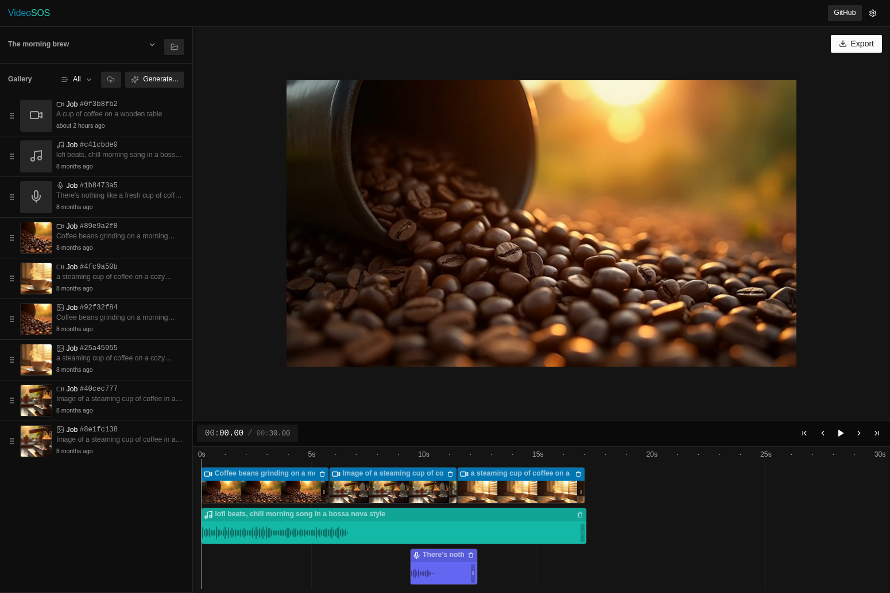
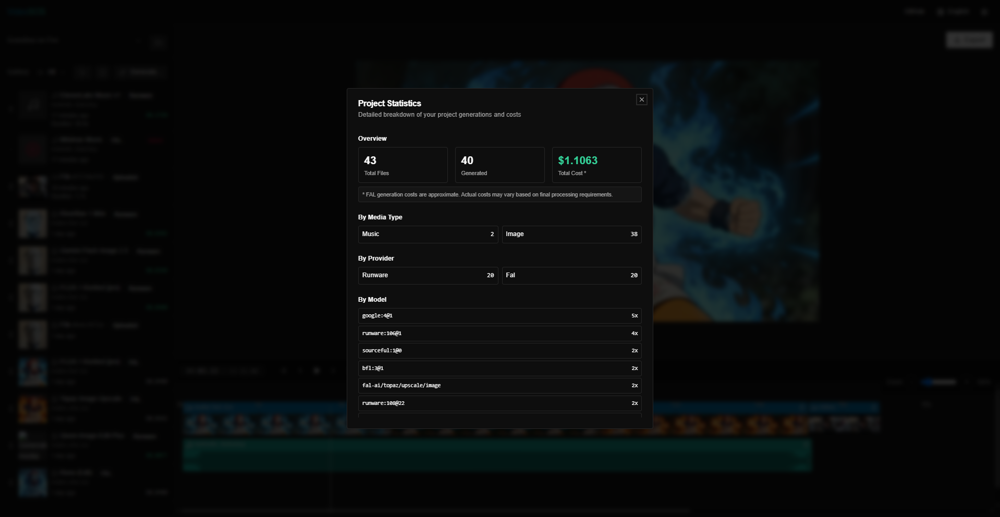

# VideoSOS - AI Видеоредактор с открытым кодом и 100+ моделями

[](https://github.com/timoncool/videosos/stargazers)
[](https://github.com/timoncool/videosos/network/members)
[](https://github.com/timoncool/videosos/issues)
[](https://opensource.org/licenses/MIT)
[](https://nextjs.org)
[](https://remotion.dev)

Создавайте профессиональные видео с AI прямо в браузере. Бесплатный видеоредактор с открытым кодом, включающий Google Veo 3.1, FLUX, Gemini 2.5 Flash, Imagen 4 и 100+ лучших AI моделей для генерации видео из текста, видео из изображений, генерации изображений, редактирования фото, создания музыки и озвучки. Без загрузок, полная конфиденциальность, продвинутый таймлайн.

**[🚀 Попробовать демо](https://videosos.vercel.app/)** | [🇬🇧 English version](./README.md)

## Скриншоты

### Видеоредактор — Основной интерфейс


### Видеоредактор — Статистика проекта


---

## Ключевые возможности

### 🤖 100+ AI моделей

VideoSOS интегрируется с **fal.ai** и **Runware.ai**, предоставляя вам передовые возможности AI генерации:

- **🎬 Генерация видео**: Текст-в-видео и изображение-в-видео с передовыми моделями включая Google Veo 3.1, Kling 2.5 и Hailuo-02
- **🎨 Генерация изображений**: Текст-в-изображение с передовыми моделями включая Gemini 2.5 Flash, Imagen 4.0, FLUX.1 Pro и Ideogram V3
- **✏️ Редактирование изображений**: AI редактирование фото с ведущими моделями включая Gemini 2.5 Flash Edit, FLUX.1 Kontext и Qwen Image Edit
- **🎵 Генерация аудио**: Композиция музыки с Stable Audio и естественная озвучка с множеством голосов

Легко переключайтесь между провайдерами или используйте оба одновременно для максимальной гибкости. [См. полный список моделей ниже](#поддерживаемые-ai-модели).

### 🔒 100% конфиденциальность
Все работает локально в вашем браузере. Ваши проекты, медиафайлы и API ключи хранятся в IndexedDB на вашем устройстве. Никаких загрузок, отслеживания или сбора данных.

### 🎬 Редактор таймлайна
Продвинутое редактирование видео на нескольких дорожках с функцией перетаскивания, точным контролем ключевых кадров, визуализацией аудио-волн и превью в реальном времени. Поддержка различных соотношений сторон (16:9, 9:16, 1:1) идеально подходит для социальных сетей.

### 💰 Отслеживание затрат и статистика проекта
Встроенное отслеживание затрат и подробная аналитика проекта помогают контролировать бюджет. Отслеживайте стоимость генерации для каждого медиа-элемента, просматривайте общие расходы проекта и получайте детальную разбивку по типам медиа, AI провайдерам и использованию моделей. Идеально для управления бюджетом на AI генерации и анализа паттернов использования.

### 🔍 Продвинутый выбор моделей
Улучшенный интерфейс выбора моделей с интеллектуальным поиском, фильтрацией по провайдерам (FAL/Runware) и категоризацией по типам (текст-в-видео, изображение-в-видео, текст-в-изображение, редактирование). Отображение цен в реальном времени для моделей FAL помогает принимать обоснованные решения перед генерацией контента.

### 🎨 Мультимодальная генерация контента
Создавайте полноценные видеопроекты с AI-сгенерированными изображениями, видео, фоновой музыкой и озвучкой. Расширенные функции включают управление движением камеры, улучшение видео с Topaz и автоматическую синхронизацию губ для озвучки.

### ⚡ Обработка видео на стороне клиента
Работает на **FFmpeg.wasm** и **Remotion** для высококачественного рендеринга видео полностью в браузере. Никаких загрузок на сервер, никаких очередей. Экспортируйте видео с правильным микшированием аудио и точным контролем времени.

### 🌍 Интернациональность и доступность
Полная поддержка интернационализации (английский/русский) с горячими клавишами для опытных пользователей. Интуитивный интерфейс, разработанный как для новичков, так и для профессионалов.

## Поддерживаемые AI модели

VideoSOS включает 100+ AI моделей для генерации видео, изображений и редактирования изображений. Все модели доступны через двух провайдеров для максимальной надежности.

### Полный список моделей по категориям

#### Модели генерации видео (Текст-в-Видео)
| Модель | Провайдер | Описание |
|--------|-----------|----------|
| Veo 3.1 | FAL, Runware | Новейшая видео-модель Google с нативным аудио |
| Veo 3.1 Fast | FAL, Runware | Быстрая версия Veo 3.1 |
| Veo 3 | FAL, Runware | Кинематографическое видео с синхронизированным звуком |
| Veo 3 Fast | FAL | Быстрая генерация кинематографического видео |
| Kling 2.5 | FAL, Runware | Высококачественный синтез видео |
| Hailuo-02 | FAL, Runware | Продвинутая генерация видео |

#### Модели Изображение-в-Видео
| Модель | Провайдер | Описание |
|--------|-----------|----------|
| Veo 3.1 Image-to-Video | FAL | Анимация изображений с Veo 3.1 |
| Veo 3.1 Fast Image-to-Video | FAL | Быстрая анимация изображений |
| Veo 3 Image-to-Video | FAL, Runware | Анимация статичных изображений |
| Veo 3 Fast Image-to-Video | FAL, Runware | Быстрая анимация изображений |

#### Модели генерации изображений (Текст-в-Изображение)
| Модель | Провайдер | Описание |
|--------|-----------|----------|
| Gemini 2.5 Flash Image | FAL, Runware | Сверхбыстрая генерация изображений |
| Imagen 4.0 Ultra | FAL, Runware | Модель изображений Google высшего качества |
| Imagen 4.0 Preview Fast | FAL, Runware | Быстрые высококачественные изображения |
| Hunyuan Image 3.0 | FAL, Runware | Передовой синтез изображений |
| Seedream 4.0 | FAL, Runware | Генерация изображений высокого разрешения |
| Seedream 3.0 | FAL, Runware | Качественный синтез изображений |
| GPT Image 1 | FAL, Runware | Модель изображений OpenAI |
| FLUX.1 Pro | FAL, Runware | Профессиональная генерация изображений |
| Ideogram V3 | FAL, Runware | Рендеринг текста в изображениях |

#### Модели редактирования изображений
| Модель | Провайдер | Описание |
|--------|-----------|----------|
| Gemini 2.5 Flash Edit | FAL, Runware | Высококачественное редактирование изображений |
| FLUX.1 Kontext Pro | FAL, Runware | Контекстно-зависимое редактирование |
| FLUX.1 Kontext Dev | FAL, Runware | Редактирование для разработчиков |
| FLUX.1 Kontext Max | FAL, Runware | Редактирование максимального качества |
| Qwen Image Edit | FAL, Runware | Интеллектуальная модификация изображений |
| Reve v1 Edit | FAL | Продвинутые возможности редактирования |
| Seedream 4.0 Edit | FAL, Runware | Высококачественные трансформации |
| GPT Image 1 Edit | FAL, Runware | Редактирование изображений OpenAI |

### AI Провайдеры

VideoSOS поддерживает несколько AI провайдеров одновременно:

- **[fal.ai](https://fal.ai)** - Комплексная инфраструктура AI моделей с 50+ моделями для генерации изображений, видео и аудио
- **[Runware.ai](https://runware.ai)** - Высокопроизводительная платформа для AI инференса с 100+ моделями, включая FLUX, Google Imagen, Ideogram, Kling и другие

Вы можете использовать каждый провайдер независимо или оба одновременно. Просто добавьте ваши API ключи в диалоге настроек (нажмите на иконку шестеренки в приложении).

#### Получение API ключей

- **FAL API ключ**: Получите его на [fal.ai/dashboard/keys](https://fal.ai/dashboard/keys)
- **Runware API ключ**: Зарегистрируйтесь на [runware.ai](https://runware.ai) и получите ключ в панели управления

Оба API ключа хранятся локально в вашем браузере и никогда не отправляются на наши серверы.

### Технологический стек

- [fal.ai](https://fal.ai) - Инфраструктура для AI-моделей
- [Runware.ai](https://runware.ai) - Высокопроизводительная платформа для AI инференса
- [Next.js](https://nextjs.org) - React-фреймворк
- [Remotion](https://remotion.dev) - Обработка и композиция видео
- [FFmpeg.wasm](https://ffmpegwasm.netlify.app/) - Обработка видео на стороне клиента
- [IndexedDB](https://developer.mozilla.org/docs/Web/API/IndexedDB_API) - Хранилище в браузере
- [next-intl](https://next-intl-docs.vercel.app/) - Интернационализация
- [Vercel](https://vercel.com) - Платформа для развертывания

### Быстрый старт

1. Клонируйте репозиторий:

```bash
git clone https://github.com/timoncool/videosos
cd videosos
```

2. Установите зависимости:

```bash
npm install
```

3. Запустите сервер для разработки:

```bash
npm run dev
```

Откройте [http://localhost:3000](http://localhost:3000), чтобы увидеть приложение.

### Запуск через Docker

Если у вас установлен Docker, вы можете запустить проект в контейнере:

1. Клонируйте репозиторий:

```bash
git clone https://github.com/timoncool/videosos
cd videosos
```

2. Запустите сервисы через Docker Compose:

```bash
docker compose up -d
```

3. Откройте [http://localhost:3000](http://localhost:3000), чтобы увидеть приложение.

Для остановки сервисов:

```bash
docker compose down
```

## История звёзд

[](https://star-history.com/#timoncool/videosos&Date)

## Участие в проекте

Мы приветствуем участие разработчиков любого уровня! Будь то исправление багов, добавление новых функций, улучшение документации или обсуждение идей - ваша помощь делает VideoSOS лучше для всех.

**Как принять участие:**
1. ⭐ Поставьте звезду этому репозиторию, чтобы показать поддержку
2. 🐛 Сообщайте об ошибках или предлагайте функции в [Issues](https://github.com/timoncool/videosos/issues)
3. 🔧 Отправляйте pull request'ы - см. наше [Руководство по участию](CONTRIBUTING.md)
4. 📖 Улучшайте документацию
5. 💬 Участвуйте в обсуждениях и помогайте другим пользователям

Каждый вклад важен, каким бы маленьким он ни был! Давайте вместе создадим лучший видеоредактор с открытым исходным кодом на базе AI.

### Авторы

Собрал [Nerual Dreming](https://t.me/nerual_dreming) - основатель [ArtGeneration.me](https://artgeneration.me/), техноблогер и нейро-евангелист.

Этот проект был создан при помощи [Devin](https://app.devin.ai/invite/fdc44857a73c4afea4c0763e67c7a2d2) - AI инженера-программиста. Попробуйте автономное кодирование с бесплатной пробной версией Devin.

Этот проект является форком оригинального [AI Video Starter Kit](https://github.com/fal-ai-community/video-starter-kit) от сообщества fal.ai.

### Лицензия

Этот проект лицензирован по лицензии MIT - подробности см. в файле [LICENSE](LICENSE).
